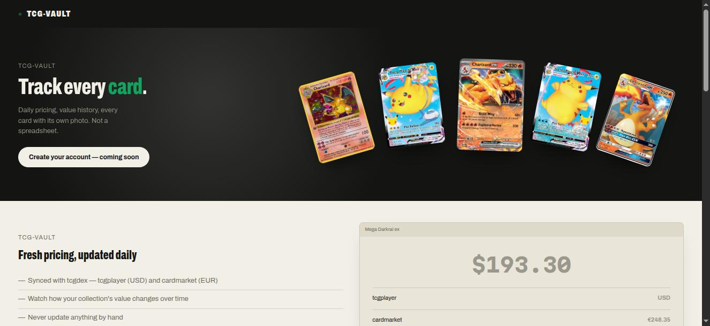
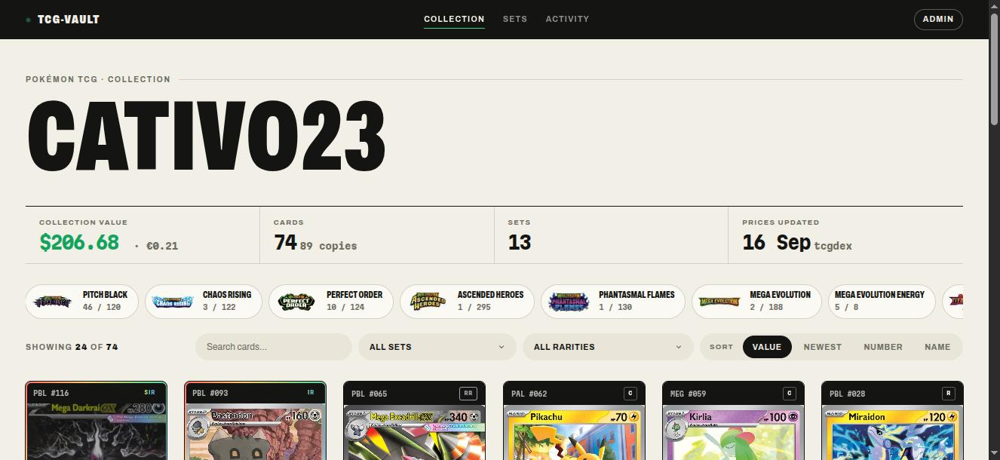

<p align="center">
  <picture>
    <source media="(prefers-color-scheme: dark)" srcset=".github/logo-dark.svg">
    
  </picture>
</p>

<p align="center">
  <a href="https://tcgvault.cativo.dev"></a>
  <a href="LICENSE"></a>
  
  
  
</p>

A personal Pokémon TCG collection tracker. A collector adds the cards they
own (manually, or by importing a TCGplayer export), and gets a public
gallery with daily-synced market pricing (tcgplayer USD + cardmarket EUR),
set completion tracking, and a price/activity history — all sourced from
[tcgdex](https://tcgdex.dev/).

**Live at [tcgvault.cativo.dev](https://tcgvault.cativo.dev).**

<p align="center">
  
</p>

<p align="center">
  
</p>

## Features

- **Daily-synced market pricing** — tcgplayer (USD) and cardmarket (EUR)
  per card, per variant, via [tcgdex](https://tcgdex.dev/); never a hand-typed value.
- **Public gallery per collector** — value totals, set completion, price
  history and an activity feed, all shareable at `/{username}`.
- **A rarity accent, not just a code** — beyond the collector shorthand
  (`SIR`, `HR`...), a restrained standard/silver/chase visual tier so the
  grid is scannable even if you don't read Pokémon rarity abbreviations.
- **TCGplayer bulk import** — paste an export from the TCGplayer app,
  preview the match, confirm in chunks.
- **Your own photo, not just official art** — upload a real photo of your
  physical card; official art is always the fallback, never the other way
  round.

## Stack

Laravel 13 + Livewire 3 (plain class components) on Sail, Postgres, Redis,
Horizon for the queue. No frontend framework — Tailwind + a small
hand-rolled CSS design system (`design.md`, `resources/css/app.css`) plus
a few lines of vanilla JS (`resources/js/app.js`).

## Getting started

```bash
./vendor/bin/sail up -d
./vendor/bin/sail artisan migrate
./vendor/bin/sail npm install && ./vendor/bin/sail npm run build
```

Runs on whatever `APP_PORT` is set to in `.env` (`docker-compose.yml`
defaults to 80).

## Try it

Import an entire set (cards + current pricing) from tcgdex:

```bash
./vendor/bin/sail artisan catalog:import-set me05
```

Or sync pricing for every card already in the catalog (the same command
the daily schedule runs):

```bash
./vendor/bin/sail artisan catalog:refresh-prices
```

A single card failing (not found, transient network error, or a malformed
API response) is reported and skipped — it never aborts the rest of an
import or refresh.

## Tests

```bash
./vendor/bin/sail artisan test
```

TDD-first (red → green → refactor) on every change in this repo.

## Where to look next

- **`design.md`** — the visual design system (tokens, rules, what's locked
  vs. amendable). Read before touching any color or layout primitive.
- **`deploy/README.md`** — how the production deploy actually works
  (manual build/push/deploy to `polaris2`, no CI yet) and the architecture
  decisions behind it.

## License

[MIT](LICENSE) © Carlos Cativo
